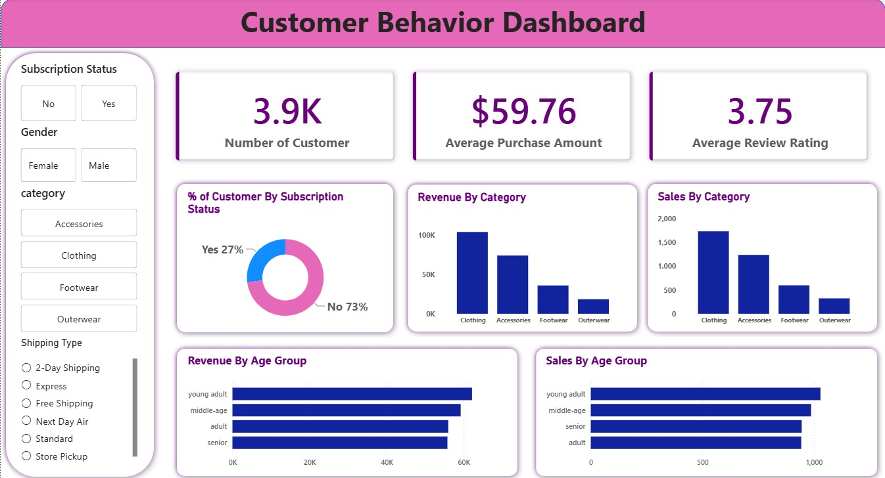

# Customer Behavior Analysis

## 📊 Project Overview

**Customer Behavior Analysis** is a data analytics project focused on understanding customer purchasing patterns, spending behavior, product performance, discounts, subscriptions, and customer segments.

The project follows an end-to-end data analytics workflow using **Python, MySQL, and Power BI**. The raw customer shopping dataset was explored and cleaned using Python, analyzed using SQL queries in MySQL, and transformed into an interactive Power BI dashboard.

The goal of this project is to turn raw customer transaction data into meaningful business insights that can support better customer engagement, marketing, and sales decisions.

## 📁 Dataset

The project uses a customer shopping behavior dataset containing **3,900 customer records and 18 columns**.

### Key Columns

* Customer ID
* Age
* Gender
* Item Purchased
* Category
* Purchase Amount (USD)
* Location
* Size
* Color
* Season
* Review Rating
* Subscription Status
* Shipping Type
* Discount Applied
* Promo Code Used
* Previous Purchases
* Payment Method
* Frequency of Purchases


## 🛠️ Tools & Technologies

| Tool                 | Purpose                                 |
| -------------------- | --------------------------------------- |
| **Python**           | Data loading, EDA, and data cleaning    |
| **Pandas**           | Data manipulation and transformation    |
| **Jupyter Notebook** | Python analysis environment             |
| **MySQL**            | SQL-based data analysis                 |
| **Power BI**         | Interactive dashboard and visualization |
| **CSV**              | Source dataset                          |

---

## 🔄 Project Workflow

```text
Raw Dataset (CSV)
       ↓
Python / Pandas
       ↓
Exploratory Data Analysis
       ↓
Data Cleaning & Transformation
       ↓
MySQL Database
       ↓
SQL Analysis
       ↓
Power BI Dashboard
       ↓
Business Insights
```


## 🐍 Step 1: Data Loading & Exploratory Data Analysis

The dataset was loaded into Python using Pandas.

The initial analysis included:

* Viewing the first few records
* Checking dataset structure
* Understanding data types
* Generating descriptive statistics
* Checking missing values
* Exploring categorical and numerical variables
* Identifying relationships between customer and purchase attributes


## 🧹 Step 2: Data Cleaning & Transformation

The dataset was cleaned and prepared for further analysis.

### Data cleaning activities included:

* Handling missing `Review Rating` values using category-wise median ratings
* Standardizing column names
* Replacing spaces with underscores
* Renaming `purchase_amount_(usd)` to `purchase_amount`
* Creating an `age_group` column
* Converting purchase frequency into numerical days
* Checking the relationship between discount and promo-code fields
* Removing the redundant `promo_code_used` column
* Add new columns like Age group and Purchase Frequency Days


## 🗄️ Step 3: MySQL Analysis

After cleaning the dataset, the data was loaded into a MySQL database.

The cleaned DataFrame was stored in the `customer` table.

SQL queries were used to answer important business questions.


## 📈 Step 4: Power BI Dashboard

The cleaned data and analytical results were used to build an interactive **Power BI dashboard**.

### Dashboard Focus Areas

* Customer overview
* Revenue analysis
* Gender-based purchasing behavior
* Product and category performance
* Customer segmentation
* Subscription analysis
* Discount behavior
* Shipping analysis
* Age-group revenue
* Purchase behavior

### Dashboard Preview




## 💡 Key Analysis & Results

The project provides insights into:

* Differences in purchasing behavior between male and female customers
* Customer spending behavior when discounts are applied
* Products receiving higher customer ratings
* Differences in spending based on shipping type
* Revenue and spending patterns of subscribers vs. non-subscribers
* Products with a high proportion of discounted purchases
* Distribution of New, Returning, and Loyal customers
* Revenue contribution across different age groups
* Customer purchase frequency and behavior

These insights can help businesses improve **customer targeting, promotional strategies, product decisions, subscription programs, and customer retention**.


## 🎯 Project Objective

The main objective of this project is to demonstrate an end-to-end **Data Analytics workflow**, starting from raw customer data and ending with an interactive business intelligence dashboard.

This project demonstrates practical skills in:

**Python → Data Cleaning → SQL → Data Analysis → Power BI → Business Insights**


## 👩‍💻 Skills Demonstrated

* Python
* Pandas
* Exploratory Data Analysis
* Data Cleaning
* Data Transformation
* SQL
* MySQL
* Data Visualization
* Power BI
* Business Analysis
* Customer Segmentation
* Analytical Thinking


## 📌 Conclusion

The **Customer Behavior Analysis** project demonstrates how raw customer shopping data can be transformed into useful business insights using Python, MySQL, and Power BI.

The combination of **EDA, data cleaning, SQL analysis, and interactive visualization** provides a complete data analytics workflow suitable for real-world business analysis.

